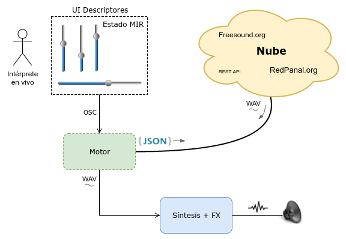
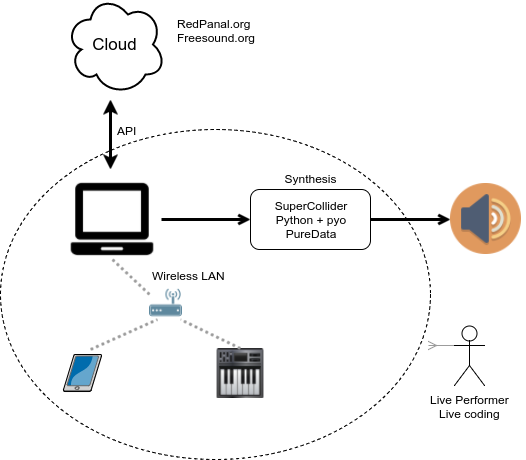
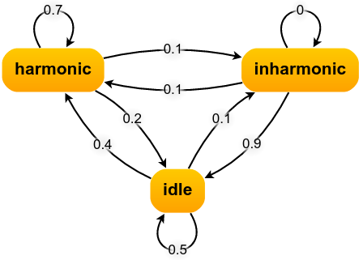
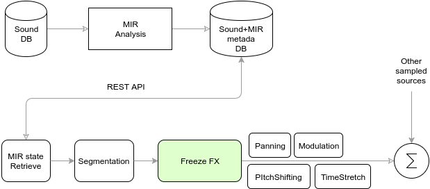

# Taller de reciclado sonidos de la web mediante técnicas MIR

* Aplicación de técnicas de Music Information Retrieval (MIR) para extraer sonidos de bases de datos online (internet)
* Efectos en tiempo real para modelar estos sonidos con criterios musicales
* Exploración de nuevas interfaces controladoras y diseño de nuevos instrumentos que aprovechen los puntos anteriores
* Implementación de prototipos utilizando Software Libre y protocolos estándar

# Resumen Día 1 (01/04/2017)
 * Contexto
   * Cloud
   * Cantidad de datos disponibles online (musicales, speech, audio en general, etc)
   * Licencias libres. Creative Commons (CC)
     * [Informe 2015](https://stateof.creativecommons.org/2015/)
     * 4 millones de tracks de audio (+42M en video y multimedia)
   * BigData. Analytics. Machine Learning
 * Introducción a MIR
   * Descriptores o features (LFC, BPM, SpectralCentroid, ..., más de 100)
     * Extracción de metadata (conocimiento)
     * [Una lista de descriptores posibles](http://essentia.upf.edu/documentation/algorithms_overview.html)
     * Opción de programar nuestro propio descritpor
     * Clusters
   * Almacenamientoo en bases de datos
 * Posibles usos artísticos de MIR + Engine Synthesis + Cloud
   * Automatizar todo o no
   * Dónde puede estar la decisión compositiva
   * Máquina de estados "MIR"
 * Arquitecturas distribuidas
   * Ventajas y desventajas
   * Redes locales. IP + puerto (ej: 10.0.1.10:57120)
   * Network Audio
 * Diferencias entre programas de síntesis. Paradigmas
   * SuperCollider, PureData (pd), Max/Msp, Python + Pyo
   * Multiplataforma. Linux, Mac, Windows. Raspberry Pi
   * Software Libre 
   * Livecoding
 * Protocolos estándar. MIDI y OSC
   * [Configurar OSC](controllers_ui/SetUp.md)
   * Usar UI de OpenStageControl para enviar mensajes a Supercollider u otro.
 * API estándar (como forma de acceso unificado)
 * App complemento: [APICultor](https://sonidosmutantes.github.io/apicultor/)
   * "Extraer miel de redpanal" (aproximación de BigData a las colecciones musicales)
   * Multiplataforma
   * Opciones: Máquina virtual o vía [Docker](https://sonidosmutantes.github.io/apicultor/docker.html).

# Resumen Día 2 (08/04/2017)
 * Repaso OSC y arquitecturas. IP + Puerto
   * [Configurar OpenStageControl](controllers_ui/SetUp.md)
 * Intro a [SuperCollider](http://supercollider.github.io/)
   * Server, Buffer's y Synth's
     * [simple_sampler.scd](SuperCollider/simple_sampler.scd)
   * Livecoding     
   * Disparar evento con MIDI y OSC
     * [sc_control.scd](SuperCollider/controladores/osc_control.scd)
     * [midi_control.scd](SuperCollider/controladores/midi_control.scd)
     * [freeze synth](SuperCollider/sampler/freeze_control_midi.scd)
   * [Ver Curso de Supercollider para principiantes](http://cmm.cenart.gob.mx/tallerdeaudio/cursos/cursocollider/textos/curso%20de%20supercollider%20principiantes.pdf) (en español)
 * Máquina de estados MIR ([Ver diagrama](state_machine.png))
   * Como composición algorítmica
   * Toma de decisiones definiendo cada estado según descriptores MIR
 * Aplicar técnicas de ingeniería de software en general
   * Desarrollo iterativo e incremental (código siempre funcionando y generando un resultado)
   * Control de versiones (git)
   * El mismo código puede ser la documentación

# Resumen Día 3 (22/04/2017)
 * Empezar a desarrollar una idea propia (mini-proyecto)
 * Extraer descriptores de sonidos propios
 * Tone Synth (ADSR, LFO noise, control de cantidad de armónicos, etc) para SuperCollider controlado por OSC.
   * [controllers_ui/example_synth_with_OpenStageControl.scd](controllers_ui/example_synth_with_OpenStageControl.scd)
   * [controllers_ui/OpenStageControl_UI/synth.js](controllers_ui/OpenStageControl_UI/synth.js)
   * Opción controlar con TouchOSC o CONTROL (Android/iOS)
 * API's
   * JSON vs XML
   * REST
   * Curl
   * [Freesound API](Freesound_API.md) y Quark para SuperCollider
   * [APICultor](APICultor_API.md) y diferentes clientes
   * [Postman](https://www.getpostman.com/) API test & dev
 * Ejercicio: Buscar el lowlevel.pitch.max value y generar una sinusoide en base a ese valor. Otra para el valor medio (mean). Y sumar.
 * [Datasets](Datasets.md)
 * Introducción a Pyo.
   * IDE (E-Pyo)
   * Ejemplo de síntesis en Raspberry Pi

# Resumen Día 4 (29/04/2017)
 * ...
 * ...
 * ...
 * Performance de cierre (19hs)
 
 # Complementos
 * [Datasets](Datasets.md)
 * [UI para enviar OSC](controllers_ui/SetUp.md)
 * [APICultor](https://sonidosmutantes.github.io/apicultor/)
 * [SonicVisualizer](http://www.sonicvisualiser.org/) + VAMP plugins
 * Librerias: Essentia, LibRosa.
 * [EarSketch](https://earsketch.gatech.edu/landing/#/)
 * [IPython Notebook (Jupyter)](https://ipython.org/notebook.html) Python interactivo
 * [Weka](http://www.cs.waikato.ac.nz/ml/weka/) (Data Mining)
 * [Postman](https://www.getpostman.com/) API test & dev
